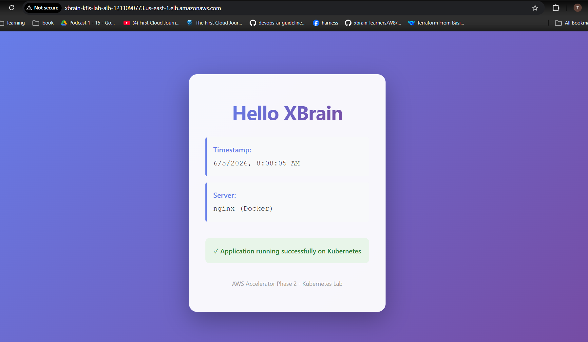

# XBrain K8s Lab on AWS

Multi-AZ Kubernetes deployment on AWS using Terraform, minikube, and ALB.

## Kiến Trúc

```
Internet (cổng 80)
    ↓
ALB (Cân bằng tải - Multi-AZ)
├─ Subnet AZ1: 10.0.2.0/24 (us-east-1a)
└─ Subnet AZ2: 10.0.3.0/24 (us-east-1b)
    ↓ HTTP định tuyến đến EC2 (NodePort 30080)
EC2 t3.medium (10.0.3.0/24, us-east-1b)
    ↓ chạy
minikube + Kubernetes
    ↓
Kubernetes Service (NodePort 30080)
    ↓ 
xbrain-app Pods (2 replicas)
├─ Pod 1: nginx → index.html (Hello XBrain)
└─ Pod 2: nginx → index.html (Hello XBrain)
    ↓
Custom "Hello XBrain" Page (màu tím)
```

**Thành Phần:**
- **AWS:** VPC (10.0.0.0/16), ALB (load balancer multi-AZ), EC2 t3.medium, Security Groups
- **Mạng:** 2 subnets công khai (AZ1 + AZ2), Internet Gateway, Route Table
- **Kubernetes:** minikube chạy trên EC2, 2 pods xbrain-app
- **Docker:** Custom image (tuphucnguyen20051/xbrain-app:latest)
- **Lưu lượng:** 80 (ALB) → 30080 (NodePort) → Pod:80 (nginx)

---

## Bắt Đầu Nhanh

### 1. Khởi Tạo Terraform
```bash
cd w8/project/terraform
terraform init
```

### 2. Lập Kế Hoạch
```bash
terraform plan
```

### 3. Triển Khai
```bash
terraform apply -auto-approve
```
⏳ **Chờ 5 phút:** EC2 khởi động → Docker & minikube cài đặt → K8s deployment chạy

### 4. Truy Cập Ứng Dụng
```bash
# Lấy URL của ALB
terraform output app_url

# Mở trong trình duyệt
http://<ALB-DNS-NAME>.us-east-1.elb.amazonaws.com
```

✅ Bạn sẽ thấy trang "Hello XBrain" với giao diện màu tím

### 5. Dọn Dẹp (Xóa Tất Cả Resources)

```bash
cd w8/project/terraform
terraform destroy -auto-approve
```

⚠️ **Nhớ destroy khi không dùng để tránh phí AWS!**

---

## Cấu Trúc Thư Mục

```
w8/project/
├── terraform/
│   ├── main.tf              # Cấu hình provider (AWS, Random)
│   ├── vpc.tf               # VPC, 2 subnets, Internet Gateway, Route Table
│   ├── ec2.tf               # EC2 instance, IAM role & policy
│   ├── alb.tf               # ALB, Target Group, Listener HTTP
│   ├── security_groups.tf   # SG rules (SSH:22, HTTP:80, NodePort:30080)
│   ├── kubernetes.tf        # K8s deployment outputs
│   ├── terraform.tfvars     # Biến cấu hình (region, CIDR, image)
│   └── variables.tf         # Định nghĩa biến
├── scripts/
│   └── setup.sh             # EC2 user_data script (Docker, minikube, kubectl, Helm)
├── app/
│   ├── Dockerfile           # nginx base + custom index.html
│   └── index.html           # Giao diện "Hello XBrain" (CSS, JS)
└── README.md
```

---

## Evidence

- [Xem evidence](./evidence.md)
- 

---
## ≥2 Providers được wire cùng Terraform config

**AWS Provider**
- VPC (10.0.0.0/16)
- 2 Subnets (AZ1: 10.0.2.0/24, AZ2: 10.0.3.0/24)
- ALB (load balancer multi-AZ)
- EC2 t3.medium (chạy minikube)
- Security Groups (SSH:22, HTTP:80, NodePort:30080)
- IAM roles & policies

**Random Provider**
- `random_id.deployment` → Tạo ID duy nhất cho deployment

---

## Giải thích thiết kế: Tại sao minikube + expose port?

**Tại sao minikube (K8s single-node)?**
- Minikube là K8s cluster tối thiểu, hoàn toàn tương thích với production K8s
- Có: Deployment, Service, NodePort, Labels, Selectors, Health Checks
- Dễ test K8s patterns mà không cần managed K8s (EKS) - tiết kiệm chi phí

**Tại sao expose port 30080 khi start minikube?**
```bash
minikube start --driver=docker --ports=30080:30080
```
- NodePort (30080) của K8s Service cần forward ra host (EC2)
- ALB → EC2:30080 → K8s Service:30080 → Pod:80 (nginx)
- Nếu không expose: ALB không reach được NodePort → Health check fail → Unhealthy

**Lưu lượng:**
```
Client (80)
    ↓
ALB (port 80)
    ↓
EC2 (port 30080)  ← Minikube expose cổng này
    ↓
K8s Service NodePort (30080)
    ↓
Pod nginx (port 80)
    ↓
index.html
```


