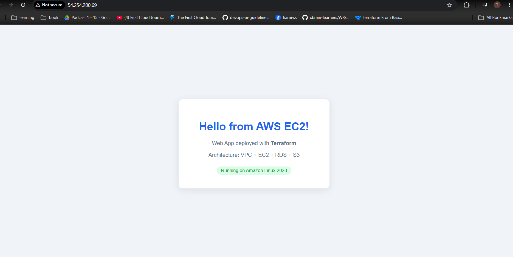

# Deploy a Web App on AWS — Terraform

Deploy a static HTML web app on AWS using Terraform with a modular structure.

**Live:** http://54.254.200.69



## Architecture

```
VPC (10.0.0.0/16)
├── Public Subnet (10.0.1.0/24, 10.0.2.0/24)
│   └── EC2 t3.micro  ← nginx serving HTML
└── Private Subnet (10.0.11.0/24, 10.0.12.0/24)
    └── RDS MySQL 8.0 (accessible from EC2 via SG)

S3 Bucket       ← static assets (encrypted, versioned)
S3 + DynamoDB   ← Terraform remote state backend
```

## Project Structure

```
tf-project/
├── bootstrap/
│   └── main.tf                  # S3 backend + DynamoDB lock (run once)
├── modules/
│   ├── vpc/                     # VPC, IGW, public/private subnets, route tables
│   ├── security_groups/         # EC2 SG (80/443/22) + RDS SG (3306 from EC2)
│   ├── ec2/                     # Amazon Linux 2023, nginx, HTML page
│   ├── rds/                     # MySQL 8.0 in private subnet
│   └── s3/                      # Static assets bucket
├── main.tf                      # Root module — wires all modules together
├── versions.tf                  # Provider + S3 backend config
├── variables.tf                 # Input variable declarations
├── terraform.tfvars             # Variable values
└── outputs.tf                   # EC2 IP, RDS endpoint, S3 bucket name
```

## Deploy

**Step 1 — Create S3 backend (once):**
```bash
cd bootstrap
terraform init && terraform apply
cd ..
```

**Step 2 — Deploy infrastructure:**
```bash
terraform init
terraform plan
terraform apply
```

**Destroy:**
```bash
terraform destroy -auto-approve
cd bootstrap && terraform destroy -auto-approve
```

## Resources Created

| Resource | Detail |
|---|---|
| VPC | `10.0.0.0/16`, 2 public + 2 private subnets |
| EC2 | `t3.micro`, Amazon Linux 2023, nginx |
| RDS | MySQL 8.0, `db.t3.micro`, private subnet |
| S3 | Static assets, AES256 encrypted, versioned |
| Security Groups | EC2 (80/443/22 open), RDS (3306 from EC2 only) |
