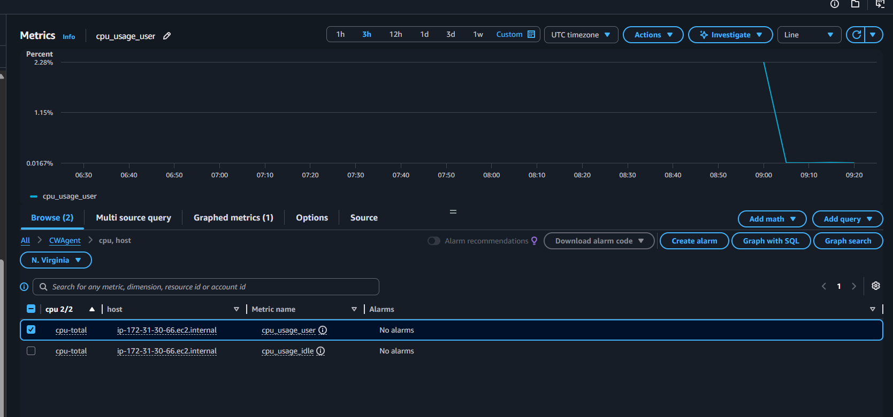

# Installing CloudWatch Agent on EC2

CloudWatch mặc định chỉ collect được CPU từ hypervisor. Muốn có thêm RAM, Disk, và các OS-level metrics thì phải cài **CloudWatch Agent** bên trong EC2 để agent đọc từ trong OS rồi đẩy lên CloudWatch.

**Prerequisite:** EC2 IAM Role phải được attach policy `CloudWatchAgentServerPolicy`.

## Kết quả

Sau khi cài CloudWatch Agent, metrics xuất hiện trong namespace **CWAgent** trên CloudWatch.

- **Namespace:** `CWAgent > cpu, host` — metrics được group theo instance hostname (`ip-172-31-30-66.ec2.internal`)
- **Metric `cpu_usage_user`:** % CPU đang được user-space processes sử dụng — đây là metric không có trong CloudWatch mặc định, chỉ có sau khi cài agent
- **Graph:** CPU usage duy trì ở mức thấp (~0.016%) cho thấy instance đang idle, agent đang chạy ổn định và push data đều đặn lên CloudWatch
