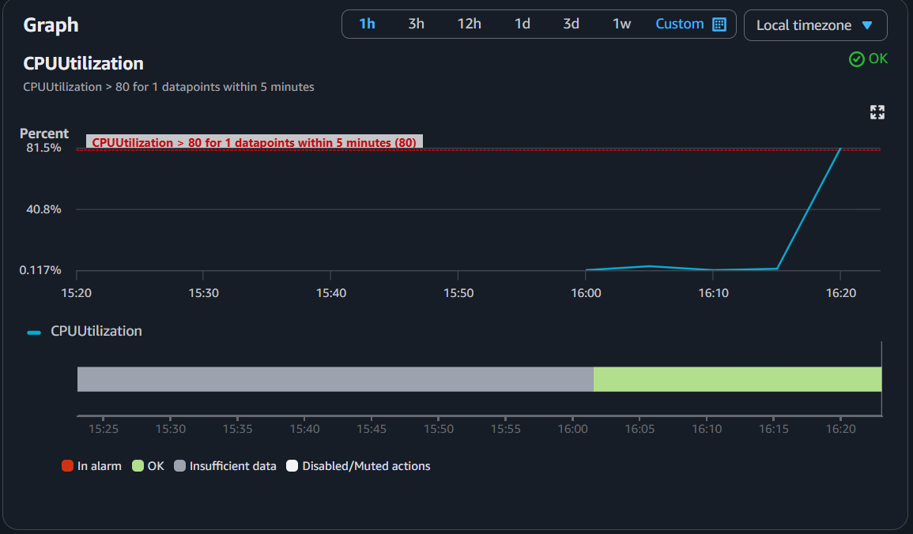
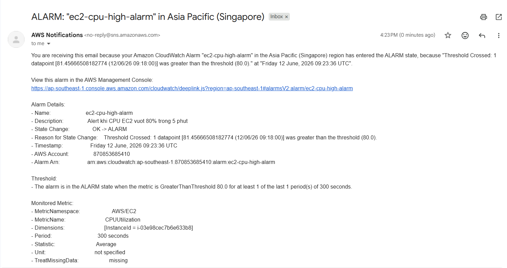

# CPU Alarm → Email Alert via SNS

Dùng Terraform tạo CloudWatch Alarm theo dõi CPU của EC2. Khi CPU vượt 80% trong 5 phút liên tiếp, alarm trigger và gửi email thông báo qua SNS.

## Resources

- `aws_instance` — EC2 t3.micro (Amazon Linux 2) dùng để monitor
- `aws_sns_topic` — SNS Topic nhận thông báo từ CloudWatch
- `aws_sns_topic_subscription` — Subscribe email vào topic
- `aws_cloudwatch_metric_alarm` — Alarm theo dõi CPUUtilization > 80%, period 5 phút

## Kết quả

**CloudWatch Alarm graph** — CPU tăng vọt lên 81.5%, vượt ngưỡng 80% đã cấu hình:

**Email nhận được từ AWS SNS** — Alarm chuyển trạng thái OK → ALARM, gửi email thông báo ngay lập tức:

